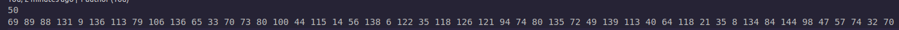
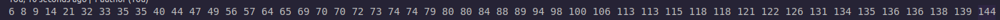
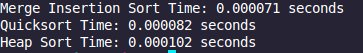
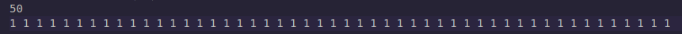
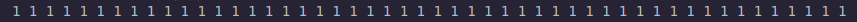
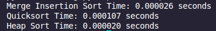
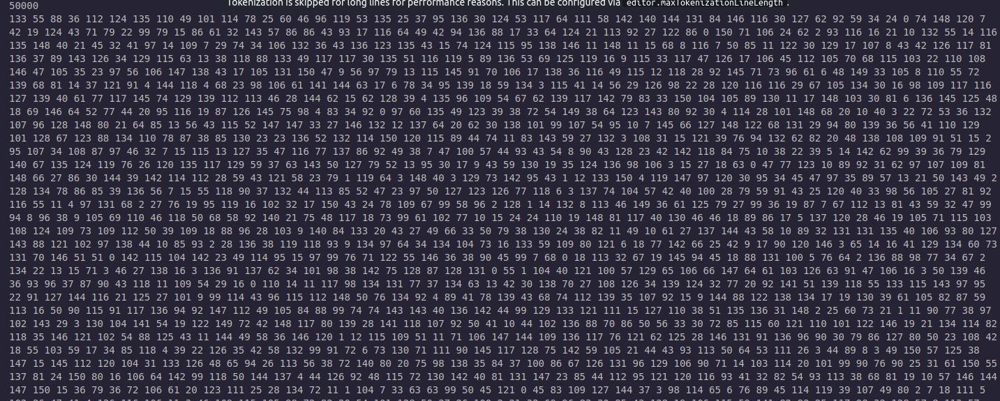
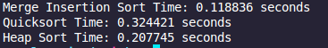
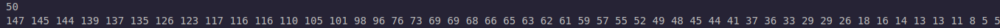
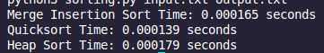

# 📊 Sort Analysis

This document presents an analysis of three sorting algorithms:  
**Merge-Insertion Sort**, **Randomized Quick Sort**, and **Heap Sort**, tested across three different input scenarios.

---

# ⏱️ Time Complexity Overview

| Algorithm             | Best Case  | Average Case | Worst Case |
| --------------------- | ---------- | ------------ | ---------- |
| Merge-Insertion Sort  | O(n log n) | O(n log n)   | O(n log n) |
| Randomized Quick Sort | O(n log n) | O(n log n)   | O(n²)      |
| Heap Sort             | O(n log n) | O(n log n)   | O(n log n) |

---

## ✅ Test Cases

### 1️⃣ Random Array of Size 50

#### 📥 Input:

#### 📤 Output:

- Merge-Insertion Sort:
  
- Randomized Quick Sort:
  
- Heap Sort:
  

#### 🧪 Benchmark:

#### 📌 Conclusion:

- 🥇 **Merge-Insertion Sort** was the fastest.This is mainly because the array was small enough to trigger the **insertion sort threshold**, making it act more like an insertion sort — which performs well on small datasets.
- 🥈 **Heap Sort** was not the fastest, as the overhead of heapifying wasn't justified for such a small input size.
- 🥉 **Randomized Quick Sort** followed closely but is the slowest here.

---

### 2️⃣ Sorted Array of Size 50 (Same Values)

#### 📥 Input:

#### 📤 Output:

- Merge-Insertion Sort:
  
- Randomized Quick Sort:
  
- Heap Sort:
  

#### 🧪 Benchmark:

#### 📌 Conclusion:

- 🥇 **Heap Sort** performed slightly better, as it does not depend on input ordering.
- 🥈 **Merge-Insertion Sort** followed very closely.
- 🥉 **Randomized Quick Sort** was the slowest. This is expected, as Randomized Quick Sort performs poorly when all elements are equal, due to unbalanced partitions and recursive overhead.

---

### 3️⃣ Random Array of Size 50,000

#### 📥 Input:

#### 📤 Output:

- Merge-Insertion Sort:
  
- Randomized Quick Sort:
  
- Heap Sort:
  

#### 🧪 Benchmark:

#### 📌 Conclusion:

- 🥇 **Merge-Insertion Sort** clearly outperformed others thanks to its hybrid structure and optimized recursion strategy.
- 🥈 **Heap Sort** came second — its time complexity remains stable regardless of input structure.
- 🥉 **Randomized Quick Sort** was the slowest due to potential unbalanced partitioning and larger recursive stack depth.

Got it! Here's the **revised conclusion** for part 4 with the correct ranking:

---

### 4️⃣ Random Reverse-Sorted Array of Size 50

#### 📥 Input:

#### 📤 Output:

- Randomized Quick Sort:  
  

- Merge-Insertion Sort:  
  

- Heap Sort:  
  

#### 🧪 Benchmark:

#### 📌 Conclusion:

- 🥇 **Randomized Quick Sort** came out on top, efficiently handling the reverse-ordered input thanks to its pivot selection method and recursive partitioning.
- 🥈 **Merge-Insertion Sort** followed closely, benefiting from the early use of insertion sort and stable merging, but still slightly slower due to overhead from its hybrid structure.
- 🥉 **Heap Sort** was the slowest again, as its consistent time complexity doesn't exploit any specific order advantage and incurs more swaps and heap maintenance.

---

# 📎 Summary Table

| Test Case             | Winner               | Notes                                                    |
| --------------------- | -------------------- | -------------------------------------------------------- |
| Random (Size 50)      | Merge-Insertion Sort | Insertion threshold gave it an advantage on small inputs |
| Same values (Size 50) | Heap Sort            | Heap sort unaffected by identical values                 |
| Random (Size 50,000)  | Merge-Insertion Sort | Fastest in large datasets thanks to hybrid approach      |

---

# 🔍 Final Thoughts

Each algorithm shines under different conditions:

- **Merge-Insertion Sort** is excellent for general usage, combining the strengths of merge and insertion sort.
- **Randomized Quick Sort** is fast but sensitive to input structure; its median-of-three pivot helps, but not always enough.
- **Heap Sort** is robust and consistent but often has larger overhead, making it less performant on small inputs.
