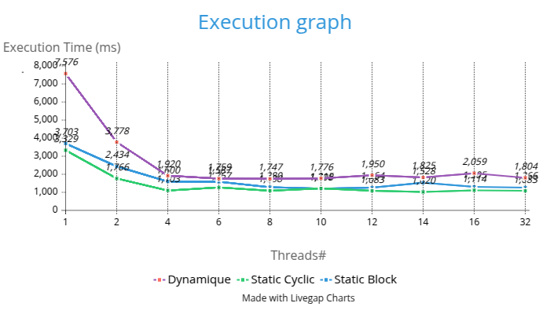
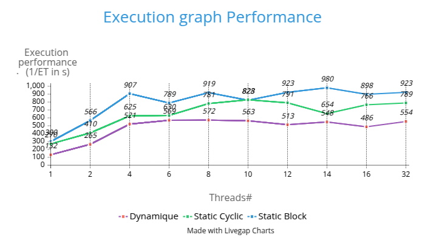

# Problem 1 report

## Environment

## 1. Environment

| Property                     | Value            |
| ---------------------------- | ---------------- |
| Java Version                 | 21               |
| OS Name                      | Linux            |
| OS Version                   | 6.8.0-52-generic |
| Architecture                 | amd64            |
| Available processors (cores) | 8                |
| Max memory (MB)              | 3936             |

> ✅ All compilation and execution were performed inside a Docker container using the image:
> `FROM openjdk:21-slim`

### ⏱ Execution Time (ms)

| exec time (in ms)         | 1    | 2    | 4    | 6    | 8    | 10   | 12   | 14   | 16   | 32   |
| ------------------------- | ---- | ---- | ---- | ---- | ---- | ---- | ---- | ---- | ---- | ---- |
| static (block)            | 3703 | 2434 | 1600 | 1587 | 1280 | 1208 | 1264 | 1528 | 1305 | 1266 |
| static (cyclic) (size 10) | 3329 | 1766 | 1103 | 1267 | 1088 | 1215 | 1083 | 1020 | 1114 | 1083 |
| dynamic (size 10)         | 7576 | 3778 | 1920 | 1759 | 1747 | 1776 | 1950 | 1825 | 2059 | 1804 |

---

### ⚡ Performance (1/ms)

| performance (1/s) | 1   | 2   | 4   | 6   | 8   | 10  | 12  | 14  | 16  | 32  |
| ----------------- | --- | --- | --- | --- | --- | --- | --- | --- | --- | --- |
| static (block)    | 300 | 566 | 907 | 789 | 919 | 823 | 923 | 980 | 898 | 923 |
| static (cyclic)   | 270 | 410 | 625 | 630 | 781 | 828 | 791 | 654 | 766 | 789 |
| dynamic (size 10) | 132 | 265 | 521 | 569 | 572 | 563 | 513 | 548 | 486 | 554 |

